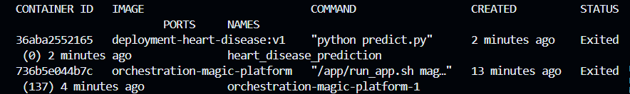

# Batch Deployment Directory

This directory contains the necessary files and instructions for deploying the Heart Disease Prediction model in a batch processing environment. Batch deployment is ideal for scenarios where predictions are not required in real-time but can be processed in large volumes at scheduled intervals.

## Overview

The batch deployment process involves building a Docker container that houses the prediction model, running the container to process a batch of input data, and then extracting the prediction results for further analysis or use.

## Contents

- `Dockerfile`: Contains the instructions for building the Docker image of the prediction model.
- `predict.py`: The Python script that loads the trained Heart Disease Prediction model and performs predictions.
- `dict_vectorizer.pkl`, `rf_model.pkl`, `scaler.pkl`: Pickle files that store trained model
## Getting Started

### Steps

1. **Build the Docker Image**

   Navigate to the batch deployment directory and build the Docker image using the following command:

   ```bash
   docker build -t deployment-heart-disease:v1 .
   ```

2. **Run the Docker Container**

   After building the image, run the container to process the input data and generate predictions:

   ```bash
   docker run --name heart_disease_prediction deployment-heart-disease:v1
   ```

   You can see the mean of the prediction as the output

3. (Optional) **Extract Prediction Output**

   Once the container has finished processing, extract the prediction output file from the container:


   - First you have to get the container id 
   ```bash
    docker ps -a
   ```
    Like this image, the `id` is `36aba2552165`
   

   - After get the id, use this command:

   ```bash
    docker cp {id}:/app/df_predict_output.csv ./df_predict_output.csv
   ```
    where `id` is the container id 


